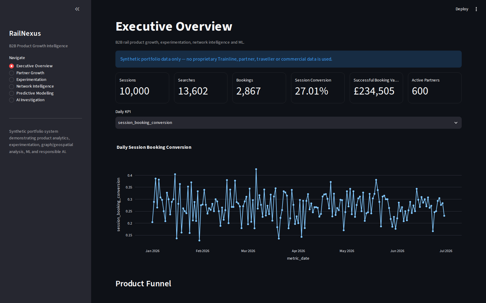
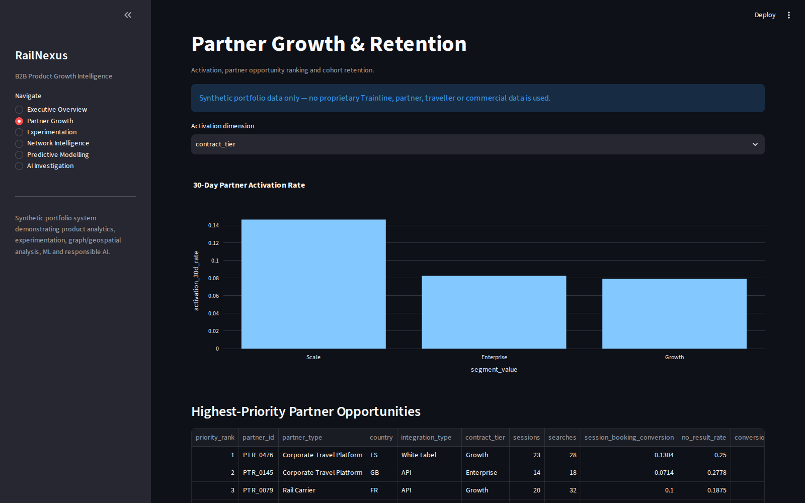
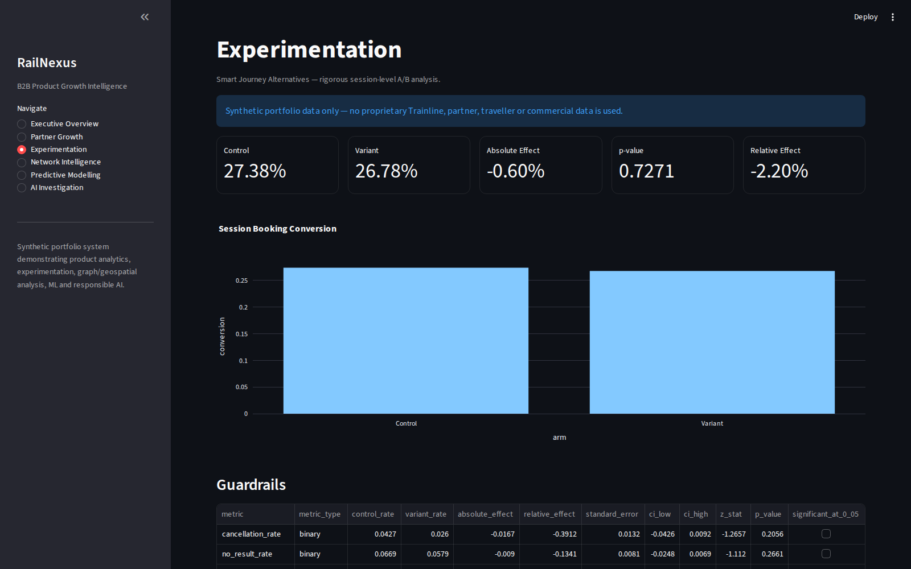
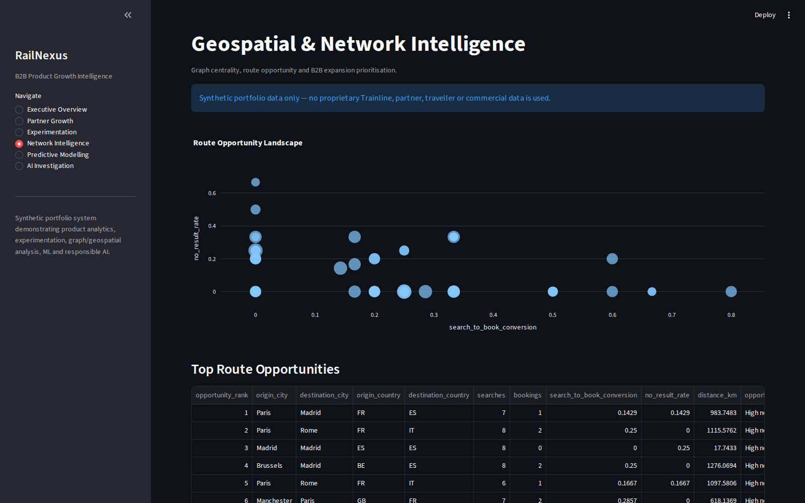
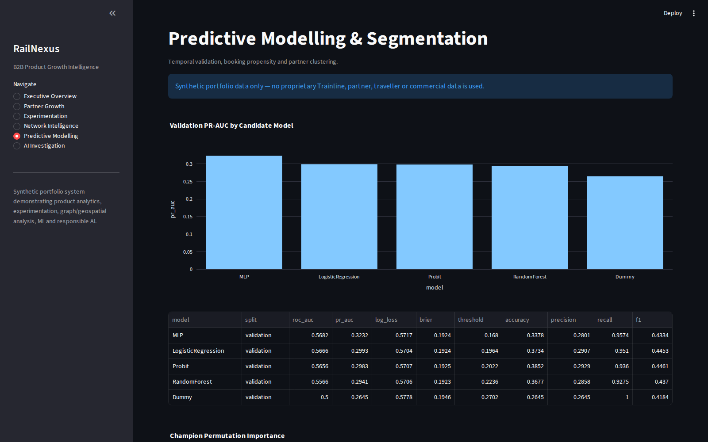
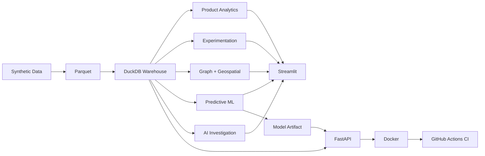

# RailNexus

## B2B Rail Product Growth, Experimentation & Network Intelligence

RailNexus is an end-to-end **product data science and analytics platform** for
a fictional European B2B rail business. It combines product analytics,
experimentation, predictive modelling, partner segmentation, graph/geospatial
analysis, responsible AI, a Streamlit application and a production-style
FastAPI/Docker/CI layer.

> **Data notice:** all partner, traveller, commercial, experiment and network
> data in this repository is synthetic. No proprietary Trainline or customer
> data is used.

## Recruiter visual pack

The screenshots below are captured automatically from the real Streamlit application after the synthetic data and analytical stages are rebuilt in CI.

<p align="center">
  
</p>

| Partner Growth & Retention | Experimentation |
| --- | --- |
|  |  |

| Network Intelligence | Predictive Modelling |
| --- | --- |
|  |  |

## What this project demonstrates

- B2B partner activation, retention, engagement and growth analytics
- search → results → selection → booking funnel measurement
- product metric trees and launch guardrails
- A/B testing with SRM, confidence intervals, CUPED-style adjustment,
  partner-clustered inference, power/MDE and multiple-testing control
- graph analysis using weighted PageRank and betweenness centrality
- geospatial route opportunity analysis using Haversine distance
- Logistic Regression, Probit, Random Forest and MLP modelling
- K-Means partner segmentation with silhouette-based model selection
- validation-based model selection and a **validation-locked threshold**
- AI-assisted anomaly triage with evidence-grounded governance controls
- Streamlit product analytics application
- FastAPI model and analytics service
- Docker, healthchecks and GitHub Actions CI

## Current synthetic system

| Metric | Result |
| --- | ---: |
| Sessions | 10,000 |
| Searches | 13,602 |
| Bookings | 2,867 |
| Active B2B partners | 600 |
| Session booking conversion | 27.01% |
| Successful booking value | £234,505 |
| Network stations | 360 |
| Directed network routes | 11,822 |

## Product experiment

**Smart Journey Alternatives v1**

| Metric | Result |
| --- | ---: |
| Control conversion | 27.38% |
| Variant conversion | 26.78% |
| Absolute effect | -0.60% |
| 95% CI | -3.99% to 2.78% |
| p-value | 0.727150 |
| SRM p-value | 0.251299 |

The experimental unit is the **session**. The project also evaluates guardrails,
pre-period CUPED-style adjustment, partner-clustered uncertainty, statistical
power/MDE and exploratory heterogeneous effects with false-discovery-rate
control.

## Predictive modelling

Candidate models:

- Logistic Regression
- Probit
- Random Forest
- Multi-Layer Perceptron
- Dummy baseline

**Champion: MLP**

| Locked test metric | Result |
| --- | ---: |
| ROC-AUC | 0.5632 |
| PR-AUC | 0.3116 |
| Log loss | 0.5811 |
| Brier score | 0.1969 |
| F1 | 0.4412 |
| Top-decile lift | 1.257x |

The champion is selected on the validation window. Its operating threshold is
also selected on validation data and locked before temporal test evaluation.

## Network opportunity

The current highest-ranked synthetic route opportunity is:

**Paris → Madrid**

Classification: **High no-result demand**

The route prioritisation layer combines demand, conversion gap, no-result
friction, endpoint network centrality and route distance. It is a prioritisation
heuristic, not causal inference.

## Architecture



See [`docs/ARCHITECTURE.md`](docs/ARCHITECTURE.md) for the detailed design.

## Technology

**Analytics & data:** Python, pandas, SQL, DuckDB, Parquet  
**Statistics:** SciPy, statsmodels, experiment design, confidence intervals,
power/MDE, CUPED-style adjustment  
**Machine learning:** scikit-learn, Logistic Regression, Random Forest, MLP,
K-Means, permutation importance  
**Network analysis:** NetworkX, PageRank, betweenness centrality  
**Visualisation/app:** Plotly, Streamlit  
**Serving/MLOps:** FastAPI, Pydantic, joblib, Docker, GitHub Actions, pytest,
Ruff

## Repository structure

```text
railnexus-b2b-product-growth-intelligence/
├── app/                    # Streamlit and FastAPI applications
├── config/                 # Project configuration
├── docs/                   # Architecture, experiment/model/API documentation
├── scripts/                # Reproducible pipeline stages
├── src/railnexus/          # Core synthetic-data package
├── tests/                  # Automated tests
├── reports/                # Executive findings and generated outputs
├── artifacts/              # Local model artifacts
├── data/                   # Local raw/processed synthetic data
├── Dockerfile
├── docker-compose.yml
├── pyproject.toml
└── requirements.txt
```

## Reproduce the project

Create/activate the virtual environment and install dependencies:

```powershell
python -m pip install -r requirements.txt
python -m pip install -r requirements-api.txt
```

Generate a deterministic smoke dataset:

```powershell
python scripts/generate_synthetic_data.py --sessions 10000
```

Build the analytical stages:

```powershell
python scripts/build_stage2_warehouse.py
python scripts/build_stage3_growth_analysis.py
python scripts/build_stage4_experiment.py
python scripts/build_stage5_network_intelligence.py
python scripts/build_stage6_predictive_modelling.py
python scripts/build_stage7_ai_investigation.py
python scripts/validate_stage8_app.py
python scripts/validate_stage9_production.py
```

Run validation:

```powershell
python -m ruff format --check src scripts tests app
python -m ruff check src scripts tests app
python -m pytest -q
```

## Run the product application

```powershell
python -m streamlit run app/streamlit_app.py
```

## Run the API

```powershell
python -m uvicorn app.api:app --host 127.0.0.1 --port 8000
```

Open `/docs` for the OpenAPI interface.

## Run with Docker

```powershell
docker compose up --build
```

## Key documentation

- [`docs/RECRUITER_SUMMARY.md`](docs/RECRUITER_SUMMARY.md)
- [`docs/CASE_STUDY.md`](docs/CASE_STUDY.md)
- [`docs/ARCHITECTURE.md`](docs/ARCHITECTURE.md)
- [`docs/EXPERIMENT_CARD.md`](docs/EXPERIMENT_CARD.md)
- [`docs/STAGE6_MODEL_CARD.md`](docs/STAGE6_MODEL_CARD.md)
- [`docs/AI_ASSISTED_INVESTIGATION.md`](docs/AI_ASSISTED_INVESTIGATION.md)
- [`docs/API.md`](docs/API.md)
- [`docs/PRODUCTION_HARDENING.md`](docs/PRODUCTION_HARDENING.md)

## Quality controls

The project includes deterministic data generation, grain/integrity checks,
Ruff formatting/linting, pytest, API contract tests, live container smoke tests,
Docker healthchecks and GitHub Actions CI.

## Portfolio positioning

RailNexus is designed to demonstrate the intersection of **Senior Data
Science, Product Analytics, Experimentation, B2B Growth Analytics, Machine
Learning and Analytics Engineering** in a rail-commerce context.

It is a portfolio project and does not claim employment at, internal knowledge
of, or access to proprietary data from Trainline.
