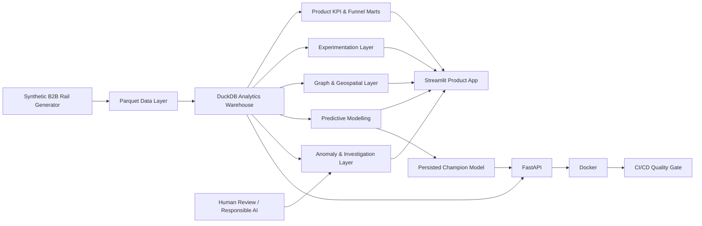

# RailNexus Architecture

## Design principles

- **Synthetic by construction:** no proprietary Trainline, partner, traveller
  or commercial data is used.
- **Reproducible analytics:** deterministic generation, DuckDB marts and
  automated validation.
- **Methodological separation:** descriptive analytics, experimentation,
  predictive modelling and anomaly triage have distinct responsibilities.
- **Leakage-aware ML:** post-booking outcomes and treatment exposure are
  excluded from booking-propensity features.
- **Locked evaluation:** model selection and operating threshold come from the
  validation period before temporal test evaluation.
- **Human-in-the-loop AI:** anomaly packets separate observations from
  hypotheses and require human review.
- **Production-style serving:** FastAPI, Pydantic contracts, read-only DuckDB,
  model metadata, Docker and CI/CD.
